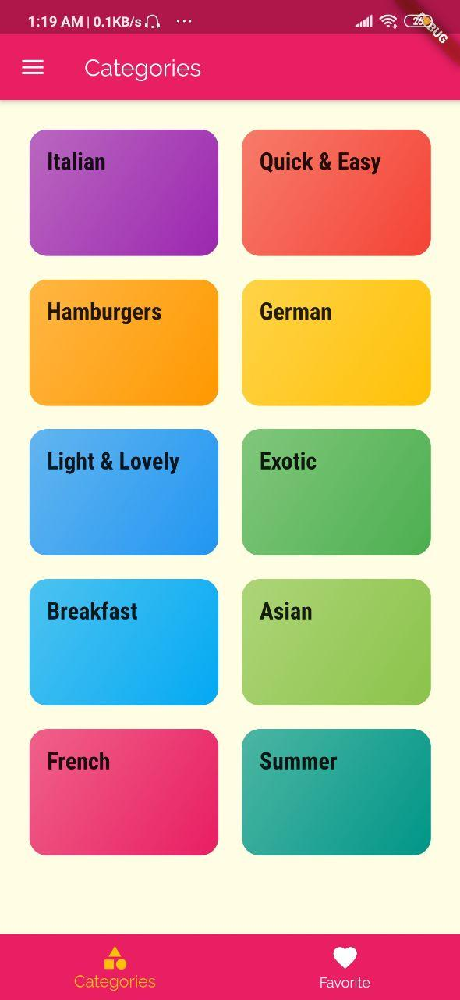
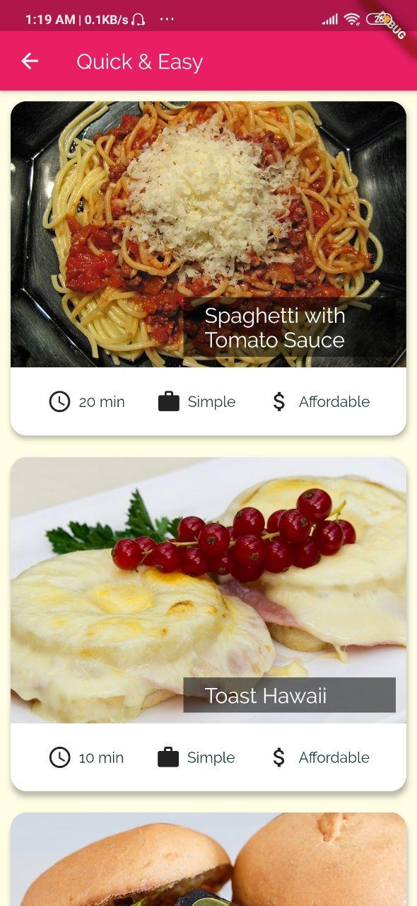
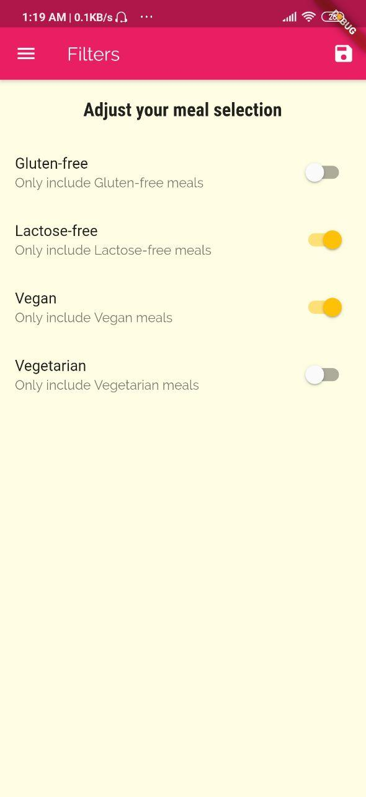

<h1 align="center">
 
  Meal APP
   
</h1>

<h4 align="center">A minimal Meal mobile app made using <a href="https://flutter.dev" target="_blank">Flutter</a>.</h4>

  
   
  
    
  

## Key Features

* Filter Meals
* All Meals have Ingredient & Steps 
* Add Favoirtes

